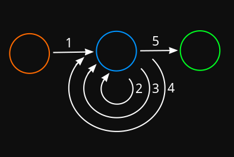

# Intro
This neural network is different from that of very basic networks. The network in question is coded in such a way as to allow neurons to be connected in whichever way it wants -- even to itself or in a loop. The neurons themself are simply structs capable of storing a couple of values and a conditional value; whilst the connections serve as "tasks" for the "processor" to go through (A -> B, then B -> C, et cetera). This allows for the removal of layer numbers and fixed amounts of and parallel connections of neurons.

_possible arrangement_